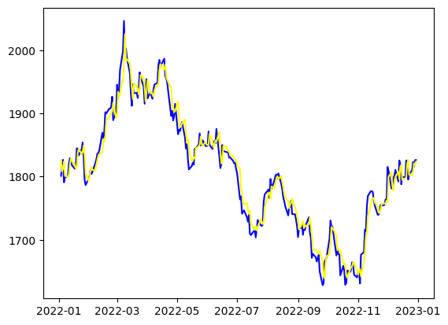
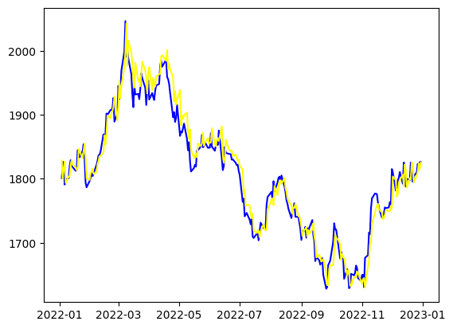
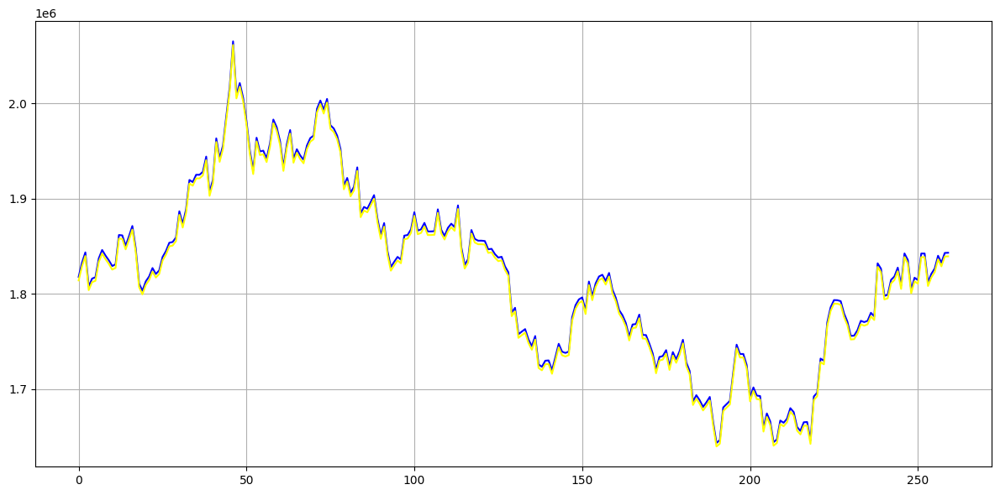

## 🚧 Code Availability

Some parts of the codebase (from the **early stages of development**) are available in this repository for reference and reproducibility.  
However, the **complete and optimized model implementation** is **not publicly available at this time**.

The model is currently performing well, and we are in the process of **preparing a research paper** based on this work.  
To maintain the integrity and originality of our results, the final version of the code will be released **after publication**.

training data : usd/usx (from 2013-2022)
we trained our models on different stages and below is the result of this early stage training

and final model is tested on the dataset of year 2023

📢 **Note:**  
We appreciate your understanding and interest in this project.  
For academic or collaborative discussions, feel free to reach out via email or LinkedIn.
